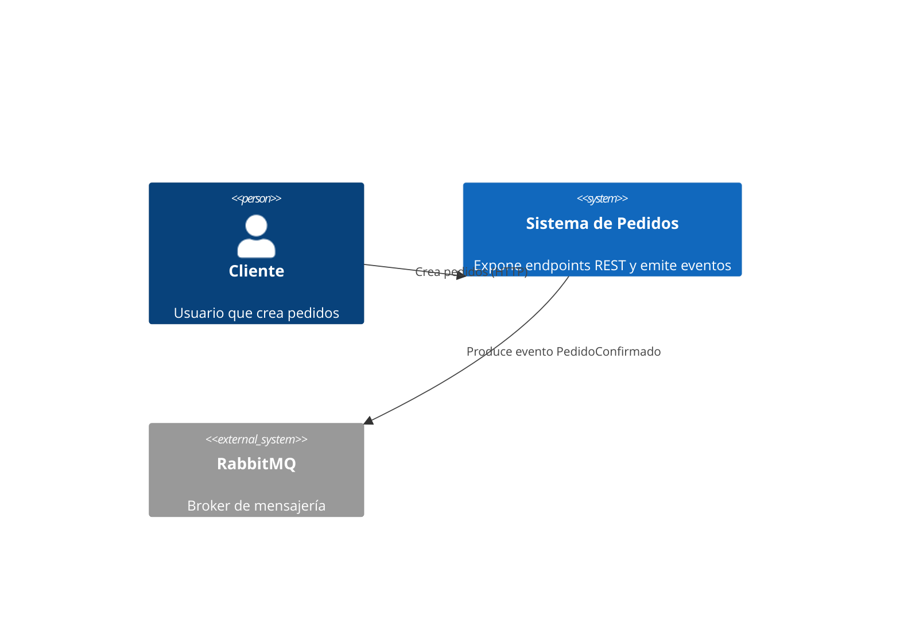
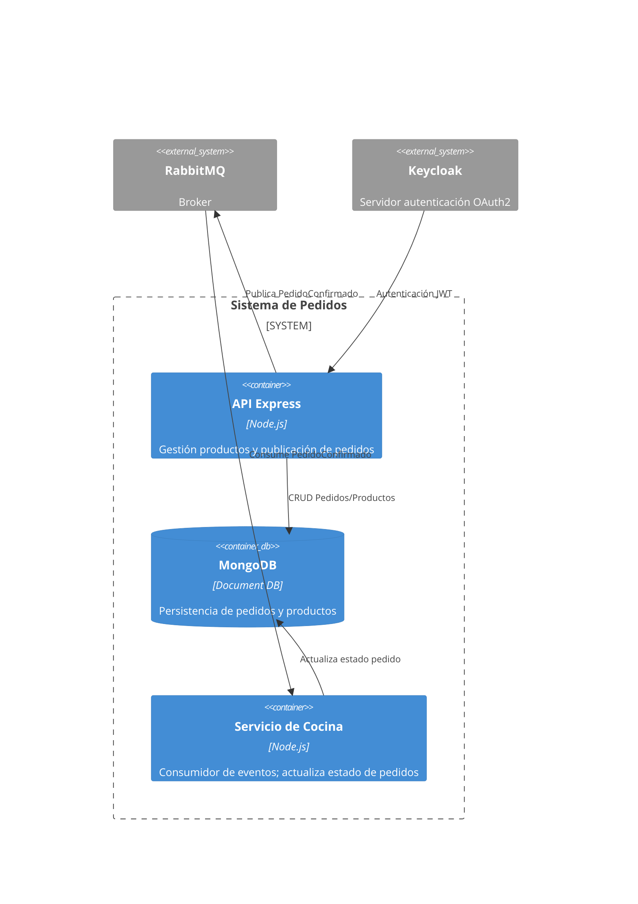
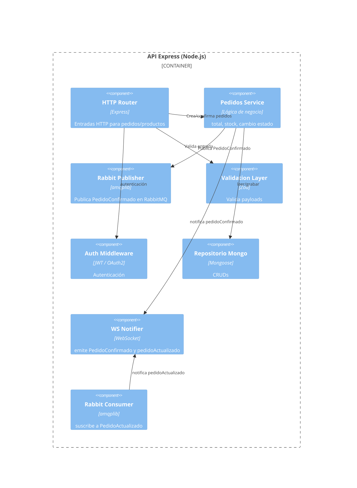
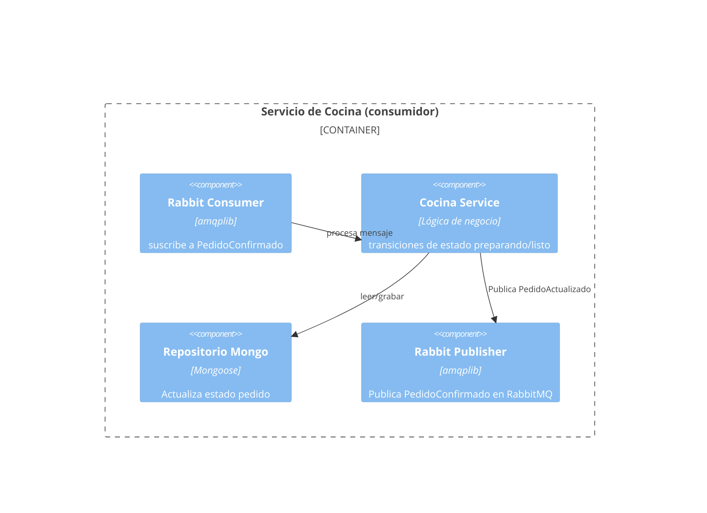

# resto-app-TP-IAEW-2025
# Sistema de Pedidos del Restaurante — Etapa 1

## Diagramas C4

### 4.1 Context Diagram
- Context: [docs/c4-context.png](docs/c4-context.png)


### 4.2 Container Diagram
- Containers: [docs/c4-containers.png](docs/c4-containers.png)



### 4.3 Component Diagram (API principal)
- Components: [docs/c4-components.png](docs/c4-components.png)




## 🧩 Explicación del funcionamiento del diagrama C4

El diagrama C4 permite visualizar cómo está estructurado y cómo interactúan las distintas partes del sistema, desde los datos que se almacenan hasta la comunicación en tiempo real entre servicios.

---

### 1. Entidades: Pedido y Producto

Estas son las entidades principales del sistema: los **pedidos** que realizan los clientes y los **productos** que se venden.

El modelo C4 muestra dónde y cómo se guardan estos datos:

- **Container Diagram:** incluye el contenedor **MongoDB [Document DB]**, que representa la **persistencia de pedidos y productos**.  
- **Components Diagram:** incluye el componente **Repositorio Mongo [Mongoose]**, responsable de las operaciones CRUD (crear, leer, actualizar y eliminar) sobre pedidos y productos.

---

### 2. Transacción: Confirmar pedido (stock, total, estados)

Este proceso representa el **corazón de la lógica de negocio**.  
En el C4, está resuelto dentro del contenedor **API Express**.

Flujo general:

1. El cliente envía una solicitud HTTP (por ejemplo, `POST /pedidos`).
2. La **capa de autenticación (Auth Middleware)** y la **capa de validación (Validation Layer)** procesan la solicitud.
3. El **Pedidos Service [Lógica de negocio]** se encarga de:
   - Calcular el **total del pedido**.  
   - Verificar el **stock disponible**.  
   - Gestionar el **cambio de estado** (por ejemplo, de “Pendiente” a “Confirmado”).  
4. Finalmente, el servicio solicita al **Repositorio Mongo** que **guarde el resultado de la transacción**.

---

### 3. Asincronía: Avances de cocina y notificaciones al cliente

Este comportamiento se divide en dos partes complementarias:

#### Avances de cocina (procesos asincrónicos)
- Cuando el **Pedidos Service** confirma un pedido, el **Event Publisher** publica un mensaje `PedidoConfirmado` en **RabbitMQ**.  
- El **Servicio de Cocina** recibe este mensaje a través de su **Rabbit Consumer**.  
- El **Cocina Service** procesa el mensaje y actualiza el estado del pedido (por ejemplo: “Preparado” o “Listo”).  
- Este flujo representa el **avance asincrónico de la cocina**, que ocurre sin bloquear el procesamiento principal.

#### Notificaciones al cliente
- Cuando el **Cocina Service** actualiza el estado (por ejemplo, a “Listo”), el componente **WS Notifier** emite el evento `pedido_actualizado`.  
- De esta forma, tanto el **cliente** como el **tablero de cocina** reciben **actualizaciones en tiempo real** sobre el avance del pedido.

---

### 4. Integración: WebSocket y tablero de cocina

En el **Container Diagram**, el contenedor **API Express** indica que **incluye un servidor WebSocket**, encargado de mantener la comunicación en tiempo real.

En el **Components Diagram**, se muestra el componente **WS Notifier**, cuya función exclusiva es **emitir eventos** (`pedido_confirmado`, `pedido_actualizado`) para que sean **recibidos y visualizados** por el tablero de cocina o el cliente final.

---

**Resumen general:**
El sistema se apoya en una arquitectura distribuida donde:
- **MongoDB** gestiona los datos.  
- **Express** ejecuta la lógica de negocio.  
- **RabbitMQ** coordina procesos asincrónicos.  
- **WebSocket** ase


## Decisiones de arquitectura
Ver ADRs en [docs/adrs/](docs/adrs/)

## Contrato de API
[openapi/api.yaml](openapi/api.yaml)

## Modelo de datos
- MongoDB (Replica Set)
- Script de migración y seed: [scripts/migrate-and-seed.js](scripts/migrate-and-seed.js)

## Release

- Para obtener el commit hash del último commit:
```bash
git rev-parse HEAD

## 🐳 Ejecución local
```bash
docker compose up -d
curl http://localhost:3000  
