# resto-app-TP-IAEW-2025
# Sistema de Pedidos del Restaurante — Etapa 1

## Diagramas C4

### 4.1 Context Diagram
- Context: [docs/c4-context.png](docs/c4-context.png)


### 4.2 Container Diagram
- Containers: [docs/c4-containers.png](docs/c4-containers.png)

```mermaid
C4Container
System_Boundary(orderSystem, "Sistema de Pedidos") {
	Container(api, "API Express", "Node.js", "Gestión productos y publicación de pedidos")
	ContainerDb(mongo, "MongoDB", "Document DB", "Persistencia de pedidos y productos")
	Container(servicioCocina, "Servicio de Cocina", "Node.js", "Consumidor de eventos; actualiza estado de pedidos")
}
System_Ext(rabbitExt, "RabbitMQ", "Broker")
System_Ext(keycloak, "Keycloak", "Servidor autenticación OAuth2 ")
Rel(api, rabbitExt, "Publica PedidoConfirmado")
Rel(rabbitExt, servicioCocina, "Consume PedidoConfirmado")
Rel(api, mongo, "CRUD Pedidos/Productos")
Rel(servicioCocina, mongo, "Actualiza estado pedido")
Rel(keycloak, api, "Autenticación JWT ")
```



### 4.3 Component Diagram (API principal)
- Components: [docs/c4-components.png](docs/c4-components.png)


## Explicación funcionamiento diagrama C4

### Entidades: Pedido, Producto
        Este es el "qué" se almacena. El C4 lo resuelve en:

        Container Diagram: Con el contenedor MongoDB [Document DB], que indica "Persistencia pedidos y productos".

        Components Diagram: Con el componente Repositorio Mongo [Mongoose], que tiene la responsabilidad explícita de CRUD pedidos/productos.

### Transacción: Confirmar pedido (stock, total, estados)
        Este es el "corazón" de la lógica de negocio. El C4 lo resuelve en el contenedor API Express:

        Un cliente llama al HTTP Router (ej: POST /pedidos).

        El Auth Middleware y Validation Layer lo aprueban.

        El componente Pedidos Service [Lógica de negocio] es el protagonista. Tu diagrama especifica que este componente es responsable de calcular el total, verificar el stock y gestionar el cambio de estado (ej: de "Pendiente" a "Confirmado").

        Finalmente, le pide al Repositorio Mongo que guarde (grabar) el resultado de esta transacción.

### Asincronía: Avances de cocina y notificaciones al cliente
        Este requisito se divide en dos partes:

- Avances de cocina (Asincronía):

        Cuando el Pedidos Service confirma el pedido, el Event Publisher publica un mensaje PedidoConfirmado en RabbitMQ.

        El Servicio de Cocina lo recibe a través de su Rabbit Consumer.

        El Cocina Service procesa el mensaje y realiza las "transiciones de estado: preparado / listo". Este es el "avance de cocina" asincrónico.

- Notificaciones al cliente:

        Una vez que el Cocina Service actualiza el estado (ej: a "Listo"), el componente WS Notifier emite el evento 'pedido_actualizado'.

        Esto notifica al cliente (o al tablero de la cocina) en tiempo real sobre ese avance.

### Integración: WebSocket tablero de cocina...

        Container Diagram: El contenedor API Express indica que "incluye servidor WebSocket".

        Components Diagram: Se muestran los componentes WS Notifier, cuya única función es emitir eventos ('pedido_confirmado', 'pedido_actualizado') para ser consumidos por un "tablero de cocina" o el cliente.


## Decisiones de arquitectura
Ver ADRs en [docs/adrs/](docs/adrs/)

## Contrato de API
[openapi/api.yaml](openapi/api.yaml)

## Modelo de datos
- MongoDB (Replica Set)
- Script de migración y seed: [scripts/migrate-and-seed.js](scripts/migrate-and-seed.js)

## 🐳 Ejecución local
```bash
docker compose up -d
curl http://localhost:3000  
