# resto-app-TP-IAEW-2025
# Sistema de Pedidos del Restaurante — Etapa 1

## Diagramas C4

### 4.1 Context Diagram
- Context: [docs/c4-context.png](docs/c4-context.png)


### 4.2 Container Diagram
- Containers: [docs/c4-containers.png](docs/c4-containers.png)

```mermaid
C4Container
System_Boundary(orderSystem, "Sistema de Pedidos") {
	Container(api, "API Express", "Node.js", "Gestión productos y publicación de pedidos")
	ContainerDb(mongo, "MongoDB", "Document DB", "Persistencia de pedidos y productos")
	Container(servicioCocina, "Servicio de Cocina", "Node.js", "Consumidor de eventos; actualiza estado de pedidos")
}
System_Ext(rabbitExt, "RabbitMQ", "Broker")
System_Ext(keycloak, "Keycloak", "Servidor autenticación OAuth2 ")
Rel(api, rabbitExt, "Publica PedidoConfirmado")
Rel(rabbitExt, servicioCocina, "Consume PedidoConfirmado")
Rel(api, mongo, "CRUD Pedidos/Productos")
Rel(servicioCocina, mongo, "Actualiza estado pedido")
Rel(keycloak, api, "Autenticación JWT ")
```



### 4.3 Component Diagram (API principal)
- Components: [docs/c4-components.png](docs/c4-components.png)


## Decisiones de arquitectura
Ver ADRs en [docs/adrs/](docs/adrs/)

## Contrato de API
[openapi/api.yaml](openapi/api.yaml)

## Modelo de datos
- MongoDB (Replica Set)
- Script de migración y seed: [scripts/migrate-and-seed.js](scripts/migrate-and-seed.js)

## 🐳 Ejecución local
```bash
docker compose up -d
curl http://localhost:3000  
