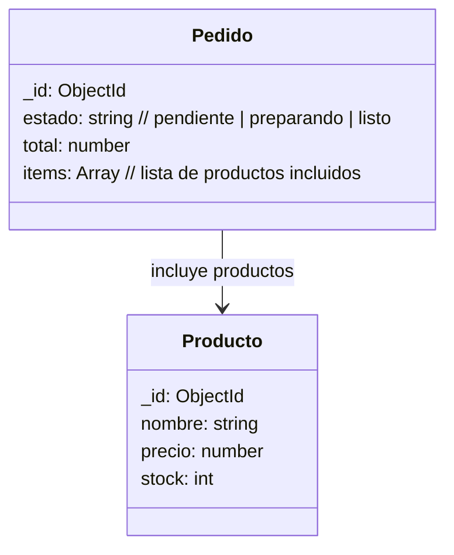

## Modelo de datos

---

### **Explicación**

- **Producto**: representa cada artículo disponible en el restaurante (nombre, precio, stock).  
- **Pedido**: contiene una lista de productos (`items`) y un estado que refleja su avance en cocina (`pendiente → preparando → listo`).  
- La relación `Pedido → Producto` indica que **cada pedido incluye uno o más productos**.  
- `total` se calcula al confirmar el pedido (transacción).  
- Los cambios de `estado` se notifican de forma **asincrónica** mediante WebSocket (según la consigna del TP).

---

